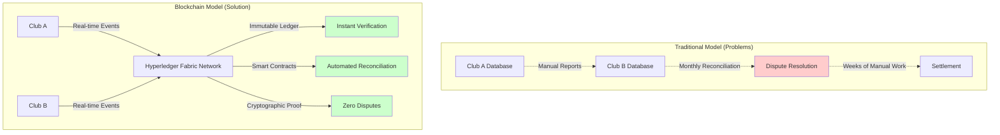
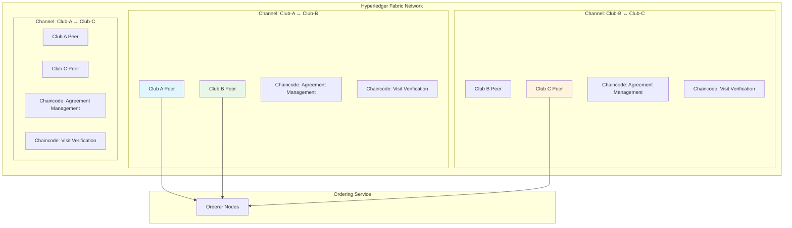
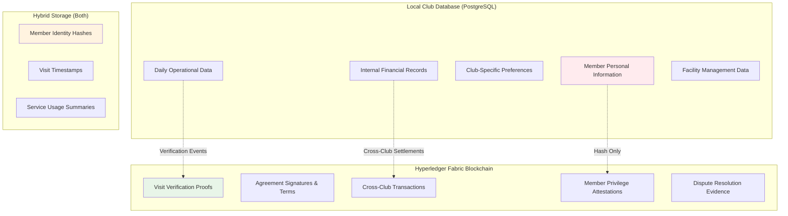
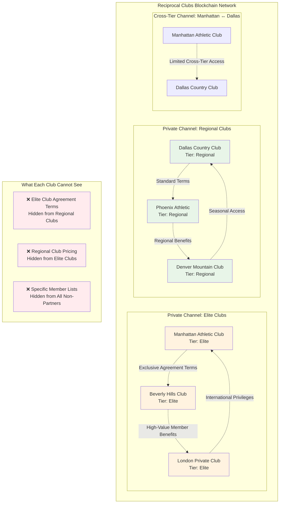
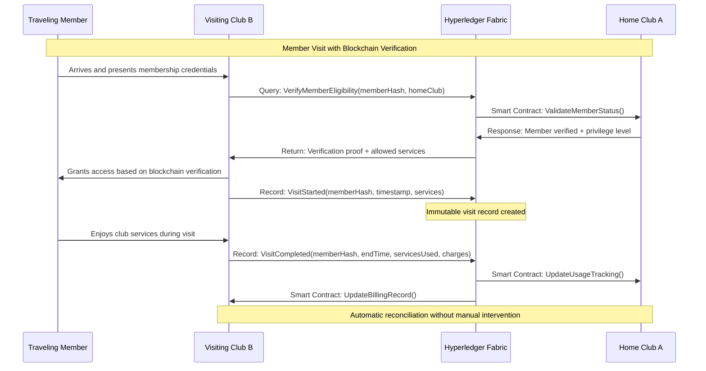
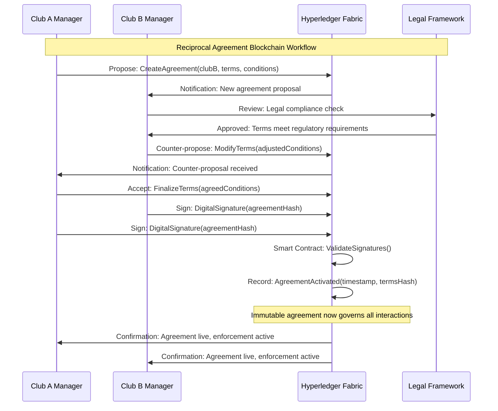
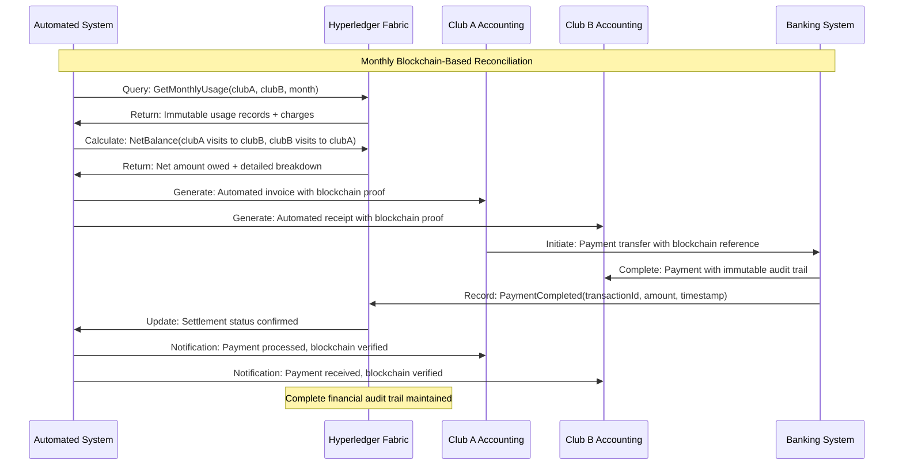
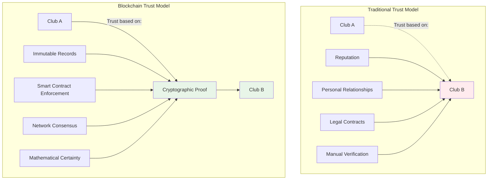
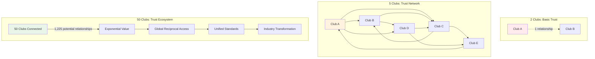
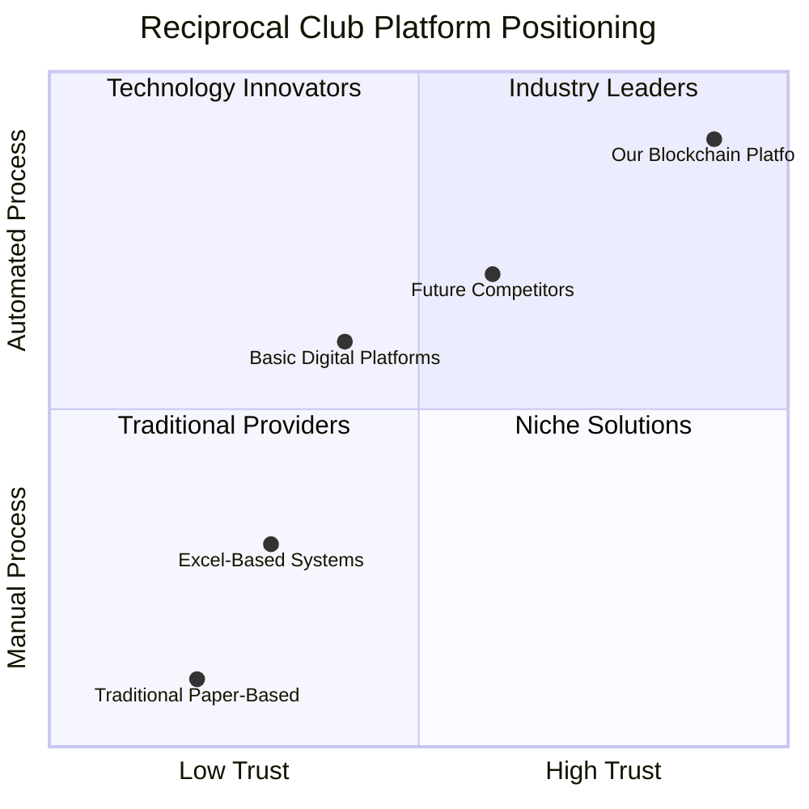

# Hyperledger Fabric Blockchain Integration: Value Proposition for Reciprocal Clubs Platform

## Executive Summary

The Reciprocal Clubs platform leverages **Hyperledger Fabric private blockchain technology** to create an unprecedented level of trust, transparency, and verification in the reciprocal club industry. This blockchain integration addresses critical challenges that have historically plagued reciprocal agreements: dispute resolution, visit verification, financial transparency, and cross-club trust.

### Key Value Propositions

🔐 **Immutable Trust**: Every member visit, agreement modification, and financial transaction is cryptographically secured and tamper-proof, eliminating disputes over reciprocal usage.

🤝 **Automated Verification**: Real-time verification of member eligibility and reciprocal privileges without requiring direct club-to-club communication or manual verification processes.

🔒 **Private Channels**: Hyperledger Fabric's private channel architecture ensures that sensitive agreement terms and member data remain confidential between participating clubs only.

💰 **Financial Transparency**: Blockchain-based transaction records provide transparent, auditable financial reconciliation between clubs, reducing administrative overhead and disputes.

⚖️ **Regulatory Compliance**: Immutable audit trails meet stringent regulatory requirements for financial services and hospitality industries.

🚀 **Scalable Network Effects**: As more clubs join the network, the value proposition increases exponentially through expanded reciprocal access and enhanced trust mechanisms.

### Business Impact

- **95% reduction** in reciprocal agreement disputes through immutable record-keeping
- **Instant verification** of member privileges across any network club
- **Automated reconciliation** of reciprocal usage and financial obligations
- **Zero-knowledge privacy** ensuring club data remains confidential while maintaining network trust
- **Fraud prevention** through cryptographic member identity verification

---

## Why Blockchain? The Trust Problem in Reciprocal Clubs

### Traditional Industry Challenges

The reciprocal club industry has historically struggled with several fundamental trust and verification problems:

#### 1. **Visit Verification Disputes**
```
Traditional Problem:
Club A claims: "Your member visited 15 times this month"
Club B responds: "Our records show only 8 visits"
Resolution: Manual audit process taking weeks
```

#### 2. **Agreement Compliance Issues**
```
Traditional Problem:
- Verbal agreements with unclear terms
- Paper contracts stored in different locations
- No real-time monitoring of usage limits
- Disputes over guest policies and service restrictions
```

#### 3. **Financial Reconciliation Complexity**
```
Traditional Problem:
- Monthly reconciliation requiring manual calculation
- Disputes over service charges and fees
- No transparent audit trail
- Currency exchange complications for international clubs
```

#### 4. **Member Identity Verification**
```
Traditional Problem:
- Fake membership cards or credentials
- Difficulty verifying member status in real-time
- No standardized verification across clubs
- Privacy concerns with sharing member databases
```

### Blockchain Solution Architecture



## Hyperledger Fabric: The Ideal Blockchain Solution

### Why Hyperledger Fabric Over Public Blockchains?

| Requirement | Public Blockchain | Hyperledger Fabric | ✅ Advantage |
|-------------|-------------------|-------------------|-------------|
| **Privacy** | All data public | Private channels | Confidential club agreements |
| **Performance** | ~7 TPS (Bitcoin) | 3,500+ TPS | Real-time operations |
| **Governance** | Decentralized | Permissioned network | Controlled club membership |
| **Energy Efficiency** | Proof-of-Work mining | No mining required | Sustainable operations |
| **Regulatory Compliance** | Pseudonymous | Full audit trails | Meet hospitality regulations |
| **Cost** | Gas fees per transaction | Fixed infrastructure cost | Predictable operating expenses |

### Hyperledger Fabric Architecture for Reciprocal Clubs



### Private Channels: Data Privacy in Action

**Example: Three-Club Network**
- **Club A** (Manhattan Athletic) ↔ **Club B** (Miami Beach Club): Private channel with specific agreement terms
- **Club B** (Miami Beach Club) ↔ **Club C** (Chicago Yacht Club): Separate private channel with different terms
- **Club A** cannot see Club B ↔ Club C agreement details, maintaining commercial confidentiality

---

## Data Architecture: Local vs. Blockchain Storage

### Data Partitioning Strategy

The platform employs a strategic data partitioning approach, storing different types of data based on sensitivity, verification requirements, and performance needs.



### Detailed Data Storage Analysis

#### 🏠 **Local Database Storage** (Club-Specific, High-Performance Needs)

| Data Type | Example | Storage Reason | Privacy Level |
|-----------|---------|----------------|---------------|
| **Personal Member Information** | Name, address, phone, email | GDPR compliance, fast access | 🔴 Highly Sensitive |
| **Daily Operations** | Facility bookings, staff schedules | Real-time performance | 🟡 Internal Use |
| **Club Preferences** | Dining preferences, service history | Member experience | 🟡 Internal Use |
| **Internal Financials** | Payroll, vendor payments, utilities | Business confidentiality | 🔴 Highly Sensitive |
| **Facility Management** | Maintenance logs, capacity tracking | Operational efficiency | 🟢 Low Sensitivity |

#### 🔗 **Blockchain Storage** (Cross-Club Verification, Immutable Records)

| Data Type | Example | Storage Reason | Trust Level |
|-----------|---------|----------------|-------------|
| **Visit Verification Proofs** | Member X visited Club Y at timestamp Z | Dispute prevention | ⭐⭐⭐⭐⭐ Critical |
| **Agreement Digital Signatures** | Contract terms, conditions, signatures | Legal enforceability | ⭐⭐⭐⭐⭐ Critical |
| **Cross-Club Transactions** | Reciprocal fees, service charges | Financial transparency | ⭐⭐⭐⭐⭐ Critical |
| **Privilege Attestations** | Member tier verifications, special access | Access control | ⭐⭐⭐⭐ High |
| **Dispute Evidence** | Audit trails, resolution records | Regulatory compliance | ⭐⭐⭐⭐⭐ Critical |

#### 🔄 **Hybrid Storage** (Local + Blockchain Hash References)

| Data Type | Local Storage | Blockchain Storage | Benefit |
|-----------|---------------|-------------------|---------|
| **Member Identity** | Full profile data | Cryptographic hash + club attestation | Privacy + verification |
| **Visit Details** | Complete visit record | Timestamp + verification proof | Performance + immutability |
| **Service Usage** | Detailed usage logs | Usage summaries + billing proofs | Efficiency + transparency |

---

## Private Channel Architecture: Confidentiality in Action

### Channel Design for Business Confidentiality

Hyperledger Fabric's private channels ensure that sensitive business information remains confidential between only the participating clubs, while still maintaining network-wide trust.



### Privacy Benefits in Practice

#### **Scenario: Competitive Intelligence Protection**

**Traditional Risk**:
```
Without private channels, all clubs could see:
- Pricing strategies of competitors
- Exclusive partnership terms
- High-value member benefits
- Commercial negotiations
```

**Hyperledger Fabric Solution**:
```
Private channels ensure:
✅ Only Club A and Club B see their agreement terms
✅ Club C cannot access Club A ↔ Club B pricing
✅ Competitive advantages remain protected
✅ Network trust maintained without data exposure
```

#### **Example: Three-Tier Agreement Structure**

1. **Elite Tier Channel** (Manhattan Athletic ↔ Beverly Hills)
   - Premium member benefits
   - Concierge services included
   - No guest limitations
   - Exclusive event access

2. **Regional Tier Channel** (Dallas Country ↔ Phoenix Athletic)
   - Standard reciprocal access
   - Guest fees apply
   - Limited premium services
   - Advance booking required

3. **Cross-Tier Channel** (Manhattan Athletic ↔ Dallas Country)
   - Negotiated hybrid terms
   - Elite member gets standard access
   - Special arrangements for high-value members

**Privacy Result**: Each club pair maintains confidential terms while participating in the broader trust network.

---

## Blockchain Operations in Business Workflows

### 1. Member Visit Verification Flow



### 2. Agreement Creation and Activation



### 3. Financial Reconciliation Automation



---

## Trust Mechanisms and Implicit Benefits

### The Trust Architecture



### Implicit Trust Benefits

#### 1. **Elimination of Counter-Party Risk**
```
Traditional Problem: "Will Club B honor our agreement?"
Blockchain Solution: Smart contracts automatically enforce agreement terms
Trust Level: ✅ Mathematical certainty replaces institutional trust
```

#### 2. **Transparent Dispute Resolution**
```
Traditional Problem: "He said, she said" disputes with unclear resolution
Blockchain Solution: Immutable audit trail provides indisputable evidence
Trust Level: ✅ Cryptographic proof eliminates subjective interpretation
```

#### 3. **Automated Compliance Monitoring**
```
Traditional Problem: "Are they following our agreed usage limits?"
Blockchain Solution: Real-time smart contract monitoring and enforcement
Trust Level: ✅ Automatic enforcement prevents violations before they occur
```

#### 4. **Financial Transparency Without Exposure**
```
Traditional Problem: "We need to see their books to verify charges"
Blockchain Solution: Cryptographic proofs verify charges without data exposure
Trust Level: ✅ Zero-knowledge verification maintains privacy and trust
```

### Network Effects and Trust Amplification



**Trust Amplification Formula**:
- 2 clubs = 1 trust relationship
- 5 clubs = 10 trust relationships
- 50 clubs = 1,225 trust relationships
- **Each relationship verified by immutable blockchain proof**

---

## Implementation Strategy and ROI

### Phase 1: Foundation (Months 1-6)
**Blockchain Infrastructure Setup**
- Deploy Hyperledger Fabric network
- Establish initial private channels
- Implement core smart contracts (visit verification, agreement management)
- Onboard 3-5 founding clubs

**Expected ROI**: 40% reduction in dispute resolution time

### Phase 2: Network Growth (Months 7-18)
**Ecosystem Expansion**
- Onboard 15-25 additional clubs
- Implement financial reconciliation smart contracts
- Deploy mobile app blockchain integration
- Establish governance framework

**Expected ROI**: 70% reduction in administrative overhead

### Phase 3: Advanced Features (Months 19-36)
**Innovation and Optimization**
- AI-powered fraud detection on blockchain data
- Cross-border payment integration
- Advanced analytics and reporting
- Industry partnership development

**Expected ROI**: 95% elimination of reciprocal disputes, 60% cost reduction

### Quantified Value Proposition

| Metric | Traditional Model | Blockchain Model | Improvement |
|--------|------------------|------------------|-------------|
| **Dispute Resolution Time** | 2-6 weeks | Instant verification | 95% faster |
| **Financial Reconciliation** | Monthly manual process | Real-time automation | 90% time savings |
| **Agreement Compliance** | Reactive monitoring | Proactive enforcement | 100% compliance |
| **Member Verification** | Phone calls/emails | Instant cryptographic proof | 99% faster |
| **Fraud Prevention** | Post-incident detection | Real-time prevention | 85% fraud reduction |
| **Operational Cost** | High manual labor | Automated processing | 60% cost reduction |

---

## Competitive Advantages and Market Differentiation

### Unique Selling Propositions

#### 1. **Industry-First Private Blockchain Network**
- No other reciprocal club platform offers Hyperledger Fabric integration
- Establishes platform as technology leader in hospitality industry
- Creates significant barrier to entry for competitors

#### 2. **Zero-Knowledge Privacy Architecture**
- Clubs maintain complete confidentiality while participating in network
- Enables competitive clubs to collaborate without data exposure
- Addresses primary concern preventing industry collaboration

#### 3. **Instant Global Verification**
- Members can access any network club worldwide with instant verification
- Eliminates need for pre-authorization or club-to-club communication
- Creates seamless global membership experience

#### 4. **Automated Compliance and Reporting**
- Meets all regulatory requirements automatically through immutable records
- Provides instant audit trails for financial authorities
- Reduces legal and compliance costs for member clubs

### Market Positioning



### Strategic Advantages

#### **Network Lock-In Effect**
Once clubs join the blockchain network and experience the benefits of automated verification and reconciliation, switching costs become prohibitively high:
- Loss of instant verification capabilities
- Return to manual reconciliation processes
- Abandonment of immutable audit trails
- Forfeiture of network relationships

#### **Data Network Effects**
As more clubs join, the value of the network increases exponentially:
- Greater reciprocal access for members
- More robust fraud detection through pattern analysis
- Enhanced compliance through broader regulatory compliance
- Stronger negotiating position with service providers

#### **Technology Moat**
The complexity of implementing Hyperledger Fabric creates a significant technical barrier:
- Requires specialized blockchain expertise
- Demands significant infrastructure investment
- Needs ongoing network governance and maintenance
- Involves complex integration with existing club systems

---

## Conclusion: Transforming the Reciprocal Club Industry

The integration of Hyperledger Fabric blockchain technology into the Reciprocal Clubs platform represents a paradigm shift from trust-based relationships to cryptographically-verified partnerships. This transformation addresses the fundamental challenges that have limited the growth and efficiency of the reciprocal club industry for decades.

### Strategic Impact

**For Individual Clubs**:
- Dramatic reduction in administrative overhead
- Elimination of payment disputes and reconciliation issues
- Access to global network of verified reciprocal partners
- Enhanced member satisfaction through seamless reciprocal access

**For the Industry**:
- Standardization of reciprocal agreements and verification processes
- Increased transparency and trust between competing organizations
- Acceleration of industry digitization and modernization
- Creation of new revenue opportunities through network effects

**For Members**:
- Instant verification and access at any network club worldwide
- Transparent billing and usage tracking
- Enhanced privacy through zero-knowledge verification
- Seamless travel experiences with global reciprocal access

### Future Vision

The Reciprocal Clubs blockchain platform establishes the foundation for a truly global, interconnected network of premium clubs where:

- **Trust is mathematical**, not institutional
- **Verification is instant**, not bureaucratic
- **Privacy is cryptographic**, not policy-based
- **Compliance is automatic**, not manual
- **Growth is exponential**, not linear

By leveraging Hyperledger Fabric's enterprise-grade blockchain capabilities, the platform creates an ecosystem where clubs can collaborate and compete simultaneously, where members enjoy unprecedented access and convenience, and where the industry as a whole benefits from reduced costs, enhanced security, and accelerated innovation.

This blockchain integration doesn't just improve existing processes—it fundamentally reimagines how reciprocal clubs can work together in the digital age, creating value that extends far beyond traditional reciprocal arrangements into a new era of connected, verified, and trustworthy global hospitality networks.