```mermaid
sequenceDiagram
    participant Admin as Administrator App
    participant Gateway as API Gateway
    participant Auth as Auth Service
    participant Member as Member Service
    participant Payment as Payment Service
    participant Blockchain as Blockchain Service
    participant Notification as Notification Service
    participant DB as PostgreSQL
    participant Cache as Redis
    participant NATS as NATS Bus
    participant Fabric as Hyperledger Fabric
    participant PaymentGW as External Payment Gateway

    Note over Admin,PaymentGW: Financial Transaction Processing Flow

    Admin->>Gateway: GraphQL Query: member($id) { account { balance } }
    Gateway->>Member: gRPC: GetMemberAccount(memberId)
    Member->>DB: SELECT account_balance, transaction_history
    DB-->>Member: Current balance and history
    Member-->>Gateway: Account information
    Gateway-->>Admin: Member account details

    Note over Admin: Administrator initiates transaction

    Admin->>Gateway: GraphQL Mutation: processPayment($input)
    Gateway->>Auth: gRPC: ValidatePermission(jwt, "payment_process")
    Auth-->>Gateway: Permission granted

    Gateway->>Payment: gRPC: ProcessTransaction(memberId, amount, services)
    Payment->>DB: BEGIN TRANSACTION
    Payment->>DB: INSERT INTO transactions (member_id, amount, type, status='PENDING')

    alt Payment Method: External Gateway
        Payment->>PaymentGW: Process payment via external provider
        PaymentGW-->>Payment: Payment confirmation or failure
    else Payment Method: Account Balance
        Payment->>DB: SELECT account_balance WHERE member_id = ?
        Payment->>DB: UPDATE account_balance SET balance = balance - amount
    end

    alt Payment Successful
        Payment->>DB: UPDATE transactions SET status='COMPLETED'
        Payment->>NATS: Publish TransactionCompleted event

        NATS->>Blockchain: Receive transaction event
        Blockchain->>Fabric: Submit transaction: recordPayment(transactionId, memberId, amount, timestamp)
        Fabric-->>Blockchain: Transaction confirmed on blockchain

        Payment->>DB: UPDATE transactions SET blockchain_tx_id = ?

        NATS->>Member: Receive transaction event
        Member->>Cache: Invalidate member balance cache
        Member->>Cache: Cache updated balance

        NATS->>Notification: Receive transaction event
        Notification->>DB: INSERT notification (transaction receipt)
        Notification->>Gateway: WebSocket: Send receipt notification

        Payment->>DB: COMMIT TRANSACTION
    else Payment Failed
        Payment->>DB: UPDATE transactions SET status='FAILED', error_message = ?
        Payment->>DB: ROLLBACK TRANSACTION
    end

    Payment-->>Gateway: Transaction result with blockchain confirmation
    Gateway-->>Admin: Payment processing result

    Note over Gateway: Real-time update via subscription
    Gateway->>Admin: Subscription: transactionStatusChanged event
```

# Business Logic Sequence Flows for Reciprocal Clubs Platform

## Overview

This document provides comprehensive business logic sequence flows showing how requests initiated from Flutter applications propagate through the microservices architecture. Each flow includes detailed diagrams showing the journey from user action to final state, including all service interactions and communication protocols.

## Platform Architecture Overview

## Communication Protocols

- **Client ↔ API Gateway**: GraphQL over HTTP/HTTPS + WebSocket for subscriptions
- **API Gateway ↔ Services**: gRPC (Protocol Buffers)
- **Services ↔ Database**: PostgreSQL native protocol
- **Services ↔ Cache**: Redis protocol
- **Services ↔ Message Bus**: NATS protocol
- **Blockchain Service ↔ Fabric**: Hyperledger Fabric SDK

---

# ADMINISTRATOR APP FLOWS

## 1. Member Check-In Flow (Daily Reception Operation)

### Flow Overview
**Trigger**: Visiting member arrives at reciprocal club
**Initiator**: Club Reception Staff via Administrator App
**End State**: Member checked in with access credentials and blockchain record

### Sequence Diagram

### Detailed Flow Steps

1. **Authentication & Authorization**
   - Administrator App sends GraphQL query with JWT token
   - API Gateway validates token via Auth Service (gRPC)
   - Auth Service checks Redis cache for token validity
   - Permission validation for `visit_manage` capability

2. **Member Lookup**
   - GraphQL query: `memberByNumber($memberNumber)`
   - API Gateway calls Member Service via gRPC
   - Member Service queries PostgreSQL for member profile
   - Results cached in Redis for performance
   - Returns member profile + home club information

3. **Reciprocal Agreement Validation**
   - GraphQL query: `reciprocalAgreements` with club filters
   - API Gateway calls Reciprocal Service via gRPC
   - Service validates agreement between home club and visiting club
   - Checks agreement status, expiry, and usage limits
   - Returns permitted services and any restrictions

4. **Visit Record Creation**
   - GraphQL mutation: `recordVisit($input)`
   - API Gateway calls Visit Service via gRPC
   - Visit Service creates record in PostgreSQL
   - Publishes `VisitCreated` event to NATS message bus

5. **Blockchain Integration**
   - Blockchain Service receives event from NATS
   - Submits transaction to Hyperledger Fabric network
   - Records immutable visit proof on blockchain
   - Updates visit record with transaction ID

6. **Real-time Notifications**
   - Notification Service receives event from NATS
   - Creates notification record for member
   - Sends real-time update via GraphQL subscription
   - Updates club dashboard with new visitor

## 2. Member Profile Update Flow (Backoffice Operation)

### Flow Overview
**Trigger**: Administrator needs to update member information
**Initiator**: Club Administrator via Administrator App
**End State**: Member profile updated with audit trail and blockchain record

### Sequence Diagram

### Detailed Flow Steps

1. **Permission Validation**
   - Administrator App requests member data for editing
   - API Gateway validates `member_write` permission via Auth Service
   - Auth Service checks role-based access control (RBAC)

2. **Current Data Retrieval**
   - GraphQL query: `member($id)` for existing profile
   - Member Service checks Redis cache first
   - On cache miss, queries PostgreSQL and caches result
   - Returns complete member profile to Administrator

3. **Profile Update Transaction**
   - GraphQL mutation: `updateMember($id, $input)`
   - Member Service starts database transaction
   - Updates member profile in PostgreSQL
   - Creates audit log entry with change details

4. **Blockchain Record**
   - Publishes `MemberUpdated` event to NATS
   - Blockchain Service creates hash of changes
   - Submits immutable record to Hyperledger Fabric
   - Updates member record with blockchain confirmation

5. **Cache Management**
   - Invalidates old member cache entry
   - Caches updated member profile
   - Ensures data consistency across requests

6. **Audit Trail**
   - Audit Service receives event and creates compliance record
   - Tracks administrator action with timestamp
   - Maintains full change history for regulatory compliance

## 3. Reciprocal Agreement Creation Flow (Advanced Operation)

### Flow Overview
**Trigger**: Club Manager initiates new reciprocal partnership
**Initiator**: Club Manager via Administrator App
**End State**: Agreement created, pending approval, with blockchain proposal

### Sequence Diagram

### Detailed Flow Steps

1. **Authorization & Partner Discovery**
   - Validates `agreement_create` permission
   - Club Service queries available reciprocal partners
   - Filters clubs that allow reciprocal agreements
   - Returns potential partner options to Administrator

2. **Agreement Creation**
   - GraphQL mutation: `createReciprocalAgreement($input)`
   - Reciprocal Service validates business rules
   - Checks for existing agreements between clubs
   - Creates agreement record with PENDING status

3. **Governance Workflow**
   - Publishes event to NATS message bus
   - Governance Service creates approval proposal
   - Sets up approval workflow with required approvers
   - Tracks voting and approval process

4. **Blockchain Proposal**
   - Blockchain Service receives creation event
   - Submits proposal to Hyperledger Fabric network
   - Creates immutable record of proposed agreement
   - Links blockchain proposal to database record

5. **Notification Distribution**
   - Notification Service sends alerts to partner club
   - Creates real-time notifications via GraphQL subscriptions
   - Ensures all stakeholders are informed of new proposal

## 4. Financial Transaction Processing Flow

### Flow Overview
**Trigger**: Service usage requires payment processing
**Initiator**: Administrator App during checkout or billing
**End State**: Transaction completed with blockchain record and updated balances

### Sequence Diagram

### Detailed Flow Steps

1. **Account Information Retrieval**
   - GraphQL query for member account balance
   - Member Service retrieves current balance and transaction history
   - Cached balance information for performance

2. **Payment Authorization**
   - Validates `payment_process` permission
   - Ensures administrator can process financial transactions
   - Confirms member account access rights

3. **Transaction Processing**
   - GraphQL mutation: `processPayment($input)`
   - Payment Service initiates database transaction
   - Processes payment via external gateway or account balance
   - Handles both successful and failed payment scenarios

4. **Blockchain Financial Record**
   - Publishes transaction event to NATS
   - Blockchain Service creates immutable payment record
   - Links blockchain transaction ID to database record
   - Ensures financial audit trail compliance

5. **Balance Updates & Notifications**
   - Updates member account balance
   - Invalidates and refreshes cache
   - Sends receipt notification to member
   - Real-time updates via GraphQL subscriptions

---

# END USER APP FLOWS

## 1. Club Discovery and Booking Flow

### Flow Overview
**Trigger**: Member searches for clubs while traveling
**Initiator**: Member via End User App
**End State**: Club discovered, reservation made, confirmation received

### Sequence Diagram

### Detailed Flow Steps

1. **Location-Based Club Search**
   - GraphQL query with geographic filters
   - Club Service uses PostGIS for spatial queries
   - Integrates with Maps API for distance calculations
   - Results cached by location for performance

2. **Club Details & Reciprocal Access**
   - Retrieves comprehensive club information
   - Checks reciprocal agreement status between clubs
   - Returns access privileges and any restrictions
   - Cached club data for faster subsequent requests

3. **Availability Checking**
   - GraphQL query: `checkAvailability` with service parameters
   - Booking Service queries current reservations
   - Calculates available capacity and time slots
   - Real-time availability checking

4. **Reservation Creation**
   - GraphQL mutation: `createReservation($input)`
   - Booking Service creates reservation record
   - Updates capacity tracking in real-time
   - Publishes event for notifications

5. **Confirmation & Notifications**
   - Sends confirmation to member via GraphQL subscription
   - Notifies club staff of new reservation
   - Generates QR code for club access
   - Updates cached availability data

## 2. Self-Service Check-In Flow

### Flow Overview
**Trigger**: Member arrives at reciprocal club
**Initiator**: Member via End User App (location-based or QR scan)
**End State**: Member checked in with digital access badge

### Sequence Diagram

### Detailed Flow Steps

1. **Location Detection**
   - End User App uses GPS to detect club proximity
   - Alternative: QR code scanning at club entrance
   - Location Service validates club geofence boundaries
   - Returns available clubs for check-in

2. **Access Validation**
   - Validates user authentication and home club
   - Reciprocal Service checks agreement status
   - Verifies member has reciprocal access privileges
   - Returns permitted services and restrictions

3. **Self-Service Check-In**
   - GraphQL mutation: `initiateCheckIn($clubId, $location)`
   - Visit Service creates check-in record
   - Generates unique access code for member
   - Records GPS location for verification

4. **Blockchain Verification**
   - Publishes check-in event to NATS
   - Blockchain Service records immutable check-in proof
   - Links GPS coordinates and timestamp to blockchain
   - Provides tamper-proof visit verification

5. **Digital Access Badge**
   - Generates QR code for club access
   - Provides club information and contact details
   - Optional notification to club staff
   - Real-time welcome message via subscription

## 3. Social Features and Activity Sharing Flow

### Flow Overview
**Trigger**: Member completes visit and wants to share experience
**Initiator**: Member via End User App
**End State**: Review posted, social connections notified, points awarded

### Sequence Diagram

### Detailed Flow Steps

1. **Visit History Retrieval**
   - GraphQL query for completed visits
   - Visit Service returns visits available for review
   - Filters out already-reviewed visits
   - Cached visit data for performance

2. **Review Creation**
   - GraphQL mutation: `createVisitReview($input)`
   - Social Service creates review record
   - Handles photo uploads to CDN
   - Links review to specific visit

3. **Analytics & Gamification**
   - Publishes review event to NATS
   - Analytics Service updates club ratings
   - Gamification Service awards points for review
   - Updates member point totals

4. **Social Notifications**
   - Notifies member's social connections
   - Real-time notifications via GraphQL subscriptions
   - Updates activity feeds for followers
   - Maintains privacy settings

5. **Activity Sharing**
   - Optional sharing to social feed
   - GraphQL mutation: `shareActivity` with privacy controls
   - Real-time feed updates for connected members
   - Social engagement tracking

## 4. Travel Planning and Companion Matching Flow

### Flow Overview
**Trigger**: Member planning travel to new destination
**Initiator**: Member via End User App
**End State**: Trip planned with club recommendations and potential travel companions

### Sequence Diagram

### Detailed Flow Steps

1. **Travel Plan Initialization**
   - GraphQL mutation: `createTravelPlan` with destination and preferences
   - Travel Service creates planning record
   - Retrieves user travel preferences and history
   - Initializes recommendation engine

2. **Club Discovery & Recommendations**
   - Searches clubs in destination city/region
   - Uses cached location data when available
   - AI Recommendation Service analyzes user preferences
   - Machine Learning generates personalized club rankings

3. **Companion Matching**
   - Social Service finds members with overlapping travel plans
   - ML Service calculates compatibility scores
   - Considers shared interests, travel style, and preferences
   - Returns potential travel companions

4. **Itinerary Creation**
   - Combines club recommendations with companion matches
   - Creates comprehensive travel plan
   - Publishes event for notification distribution
   - Real-time updates via GraphQL subscriptions

5. **Reservation Booking**
   - Member selects preferred clubs and companions
   - GraphQL mutation: `bookTravelReservations`
   - Batch booking across multiple clubs
   - Confirmation notifications to all parties

---

# CROSS-CUTTING CONCERNS

## Error Handling and Retry Patterns

### Error Propagation Flow

## Real-Time Communication Patterns

### GraphQL Subscription Architecture

## Security and Authorization Flow

### JWT Token Lifecycle

## Performance and Caching Strategy

### Multi-Level Caching Architecture

This comprehensive documentation provides complete visibility into how requests flow through the Reciprocal Clubs platform, from user initiation through all microservice interactions to final state completion, including all communication protocols and data persistence patterns.