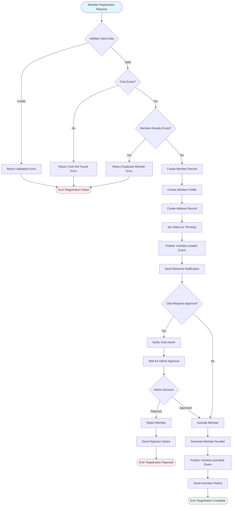
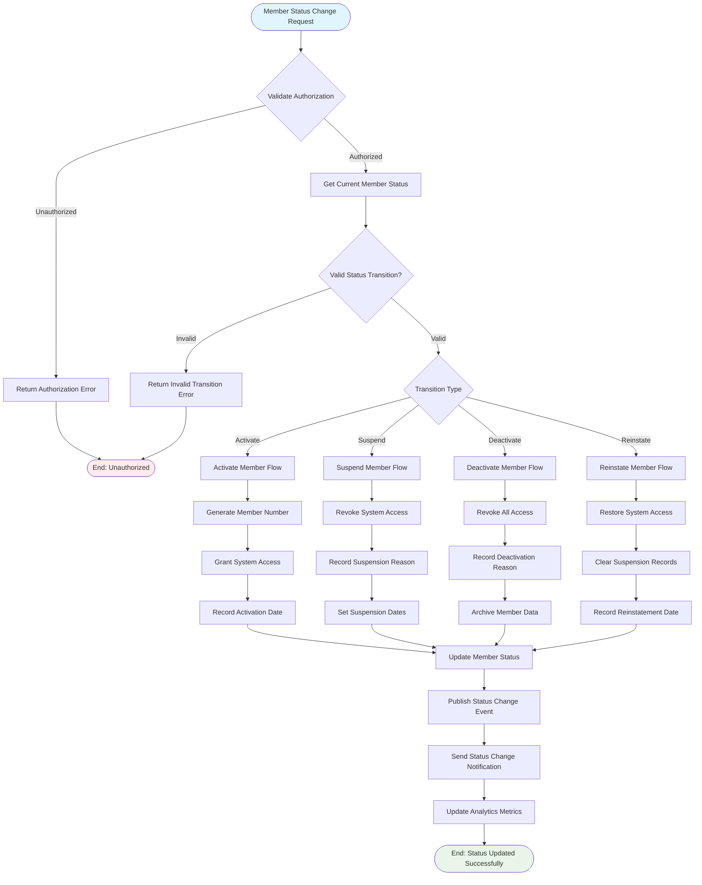
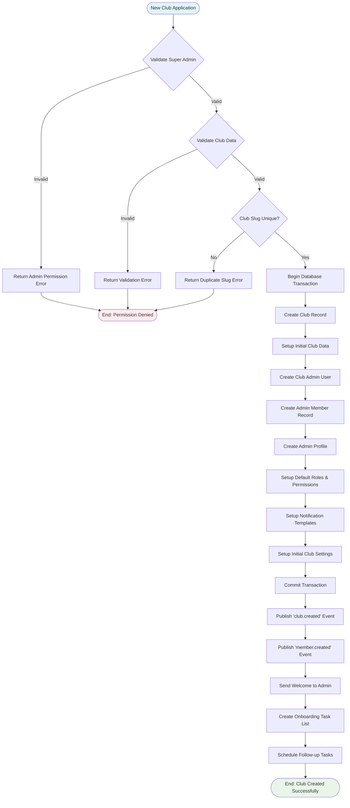
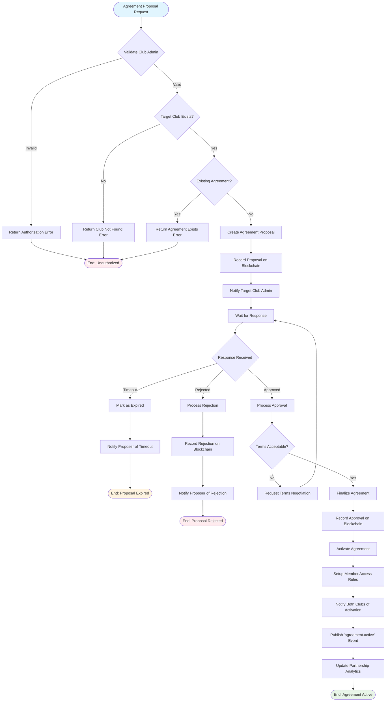
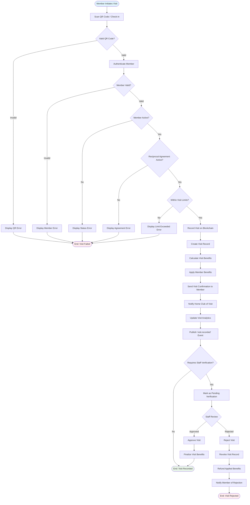
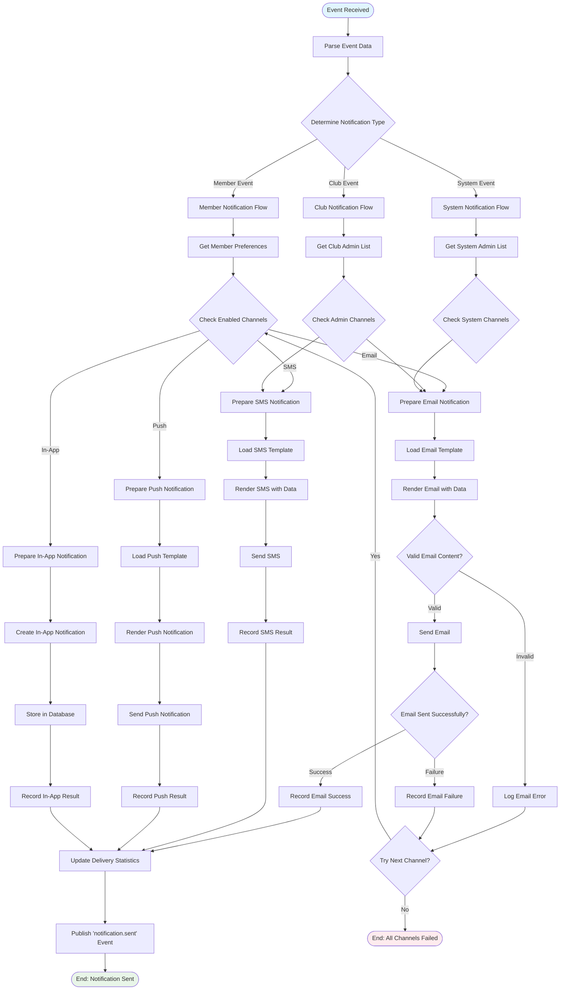
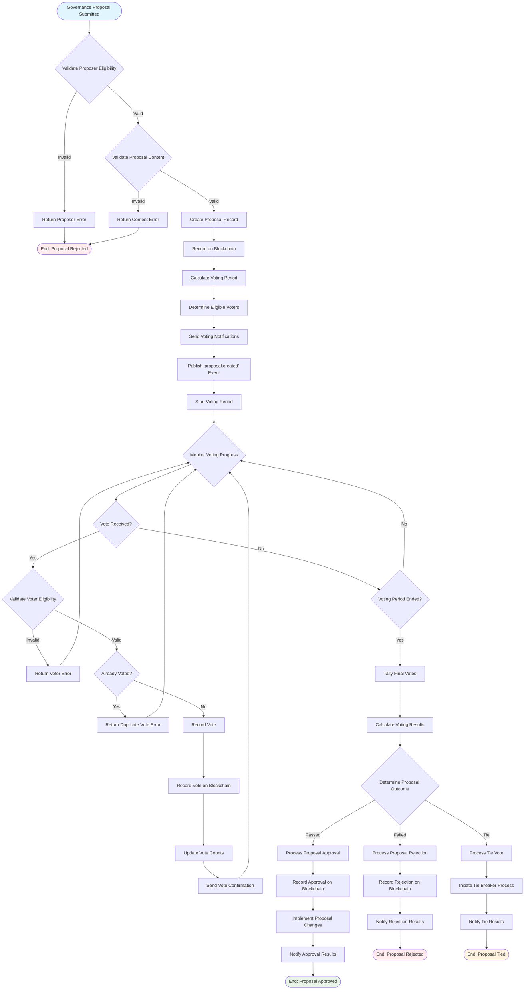
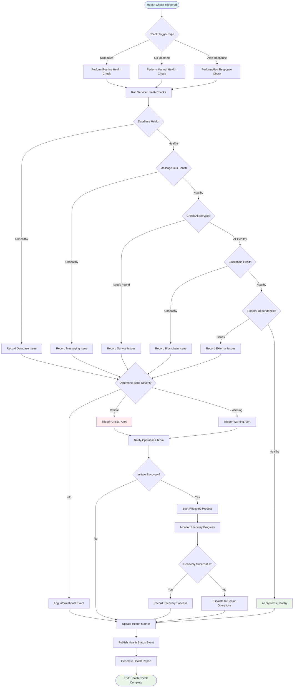
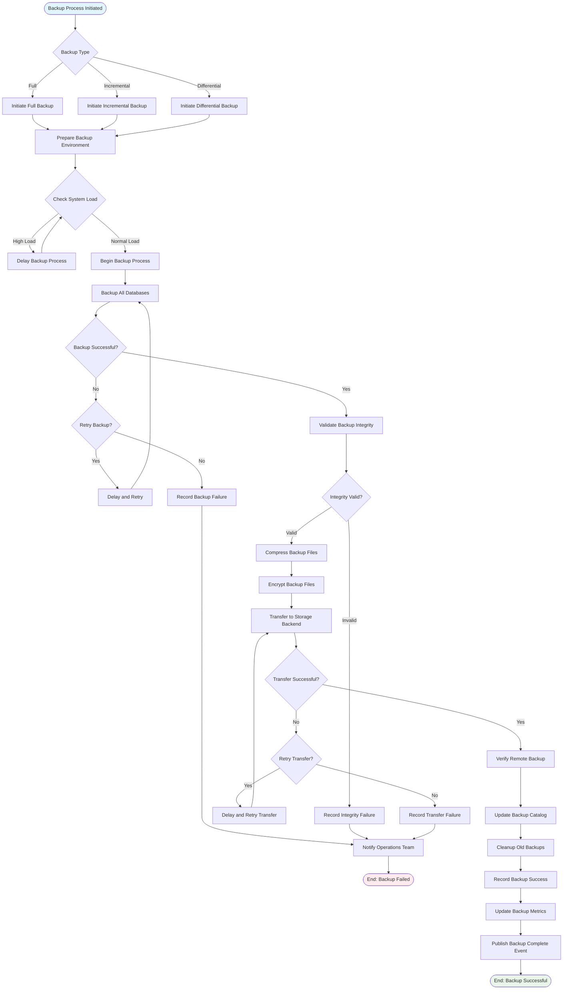

# Process Flow Diagrams - Reciprocal Clubs Backend

This document provides UML Activity Diagrams that illustrate the business process flows and user journeys within the Reciprocal Clubs Backend system.

## 1. Member Registration Process Flow

### New Member Onboarding Journey

## 2. Member Lifecycle Management Flow

### Member Status Transition Process

## 3. Club Creation and Setup Flow

### New Club Onboarding Process

## 4. Reciprocal Agreement Workflow

### Inter-Club Agreement Process

## 5. Visit Recording and Verification Flow

### Member Visit Process

## 6. Notification Processing Flow

### Multi-Channel Notification Delivery

## 7. Governance Proposal and Voting Flow

### Democratic Decision Making Process

## 8. System Health Monitoring Flow

### Automated Health Check Process

## 9. Data Backup and Recovery Flow

### Automated Backup Process

These process flow diagrams provide a comprehensive view of the business processes and operational workflows within the Reciprocal Clubs Backend system, illustrating the decision points, error handling, and successful completion paths for each major system function.