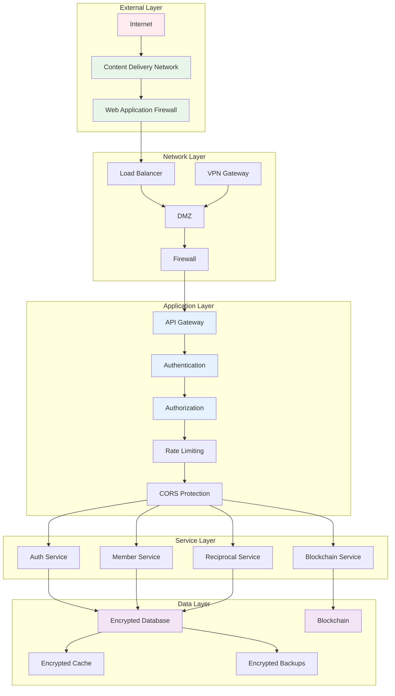
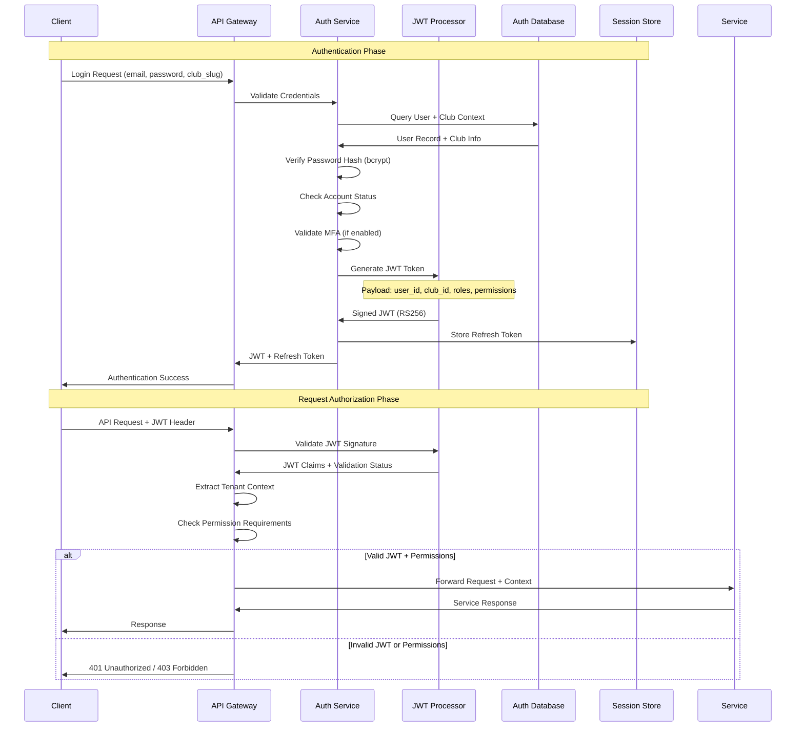
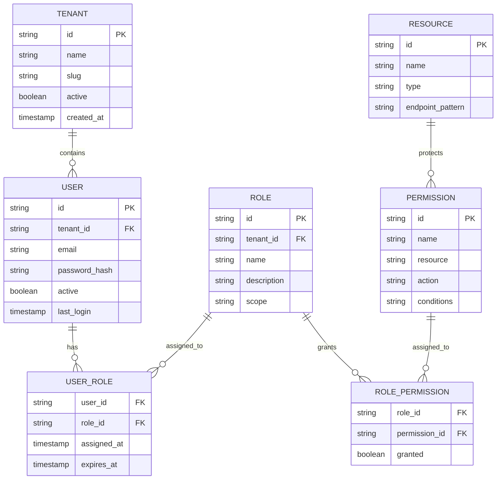
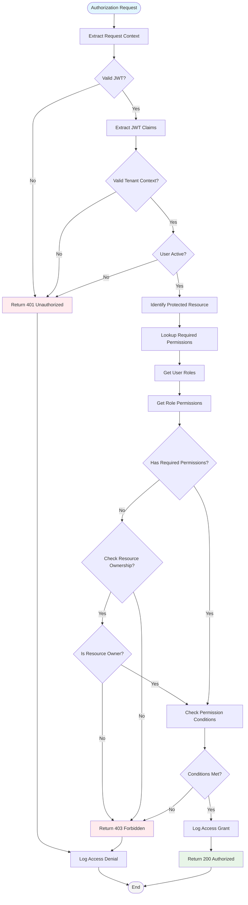
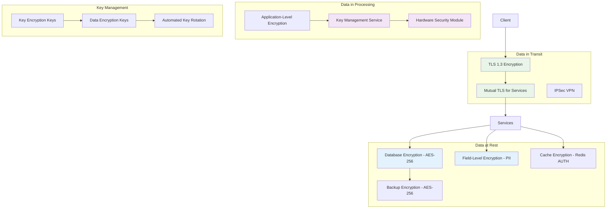
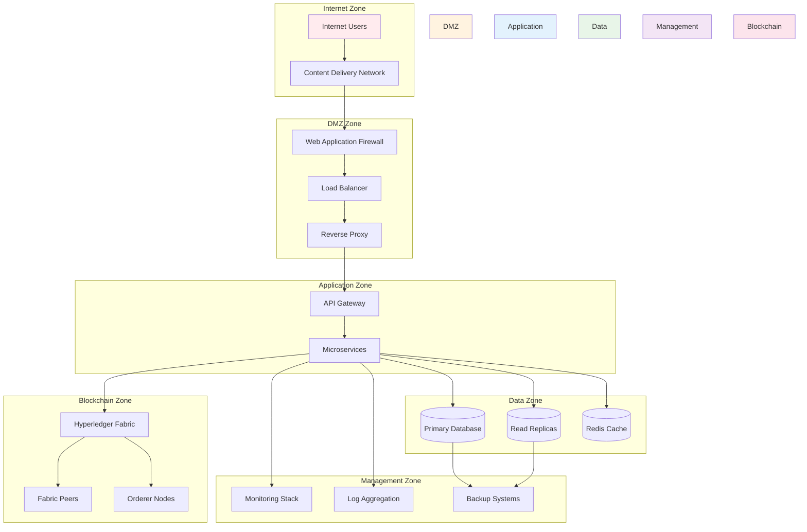
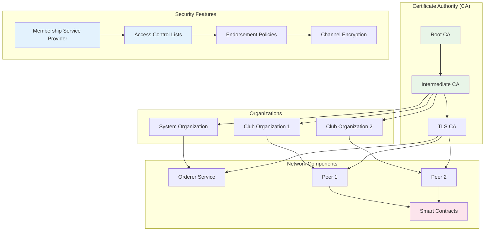
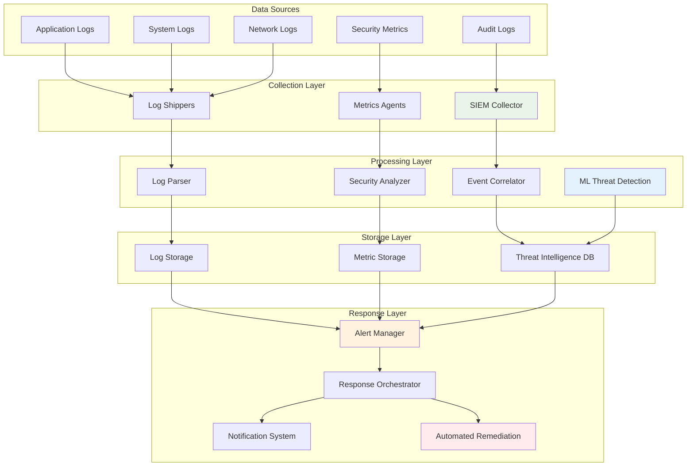
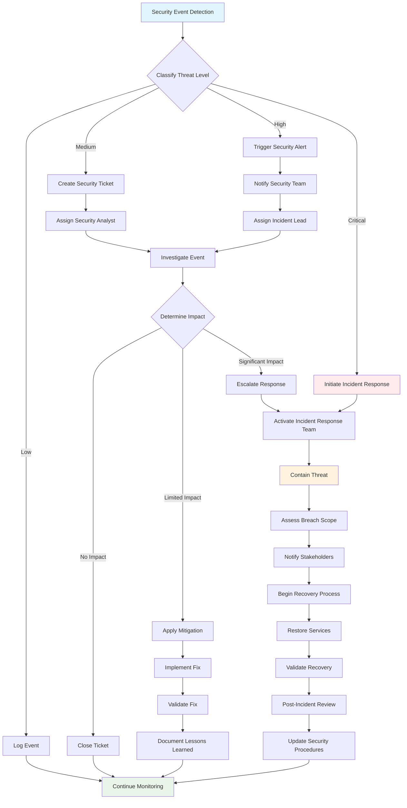
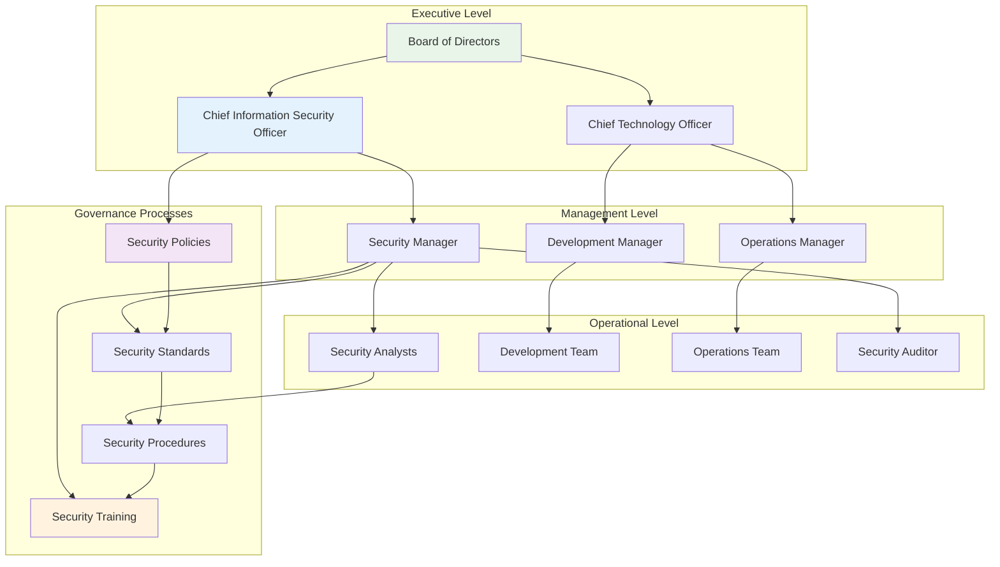

# Security Architecture - Reciprocal Clubs Backend

This document provides a comprehensive overview of the security architecture, threat model, and security controls implemented in the Reciprocal Clubs Backend system.

## Executive Summary

The Reciprocal Clubs Backend implements a defense-in-depth security strategy with multiple layers of protection across network, application, and data tiers. The system supports multi-tenant architecture with strong tenant isolation, blockchain-based audit trails, and comprehensive monitoring and incident response capabilities.

## Security Architecture Overview

### Security Layers Diagram

## Authentication Architecture

### Multi-Tenant Authentication Flow

### Authentication Security Controls

| Control | Implementation | Purpose |
|---------|---------------|---------|
| **Password Policy** | Min 12 chars, complexity rules | Prevent weak passwords |
| **Password Hashing** | bcrypt with cost factor 12 | Protect stored passwords |
| **JWT Signing** | RS256 with 2048-bit keys | Prevent token tampering |
| **Token Expiration** | 1-hour access, 30-day refresh | Limit exposure window |
| **Multi-Factor Auth** | TOTP, SMS, Email codes | Additional authentication factor |
| **Account Lockout** | 5 failed attempts, 15min lockout | Prevent brute force attacks |
| **Session Management** | Redis-based session store | Centralized session control |
| **Refresh Token Rotation** | New token on each refresh | Prevent token replay |

## Authorization Architecture

### Role-Based Access Control (RBAC) Model

### Authorization Decision Flow

## Data Protection Architecture

### Encryption Strategy

### Field-Level Encryption Schema

| Data Type | Encryption Method | Key Type | Rotation Period |
|-----------|------------------|----------|-----------------|
| **PII (Names, Addresses)** | AES-256-GCM | DEK | 90 days |
| **Financial Data** | AES-256-GCM | DEK | 60 days |
| **Authentication Data** | bcrypt + salt | N/A | N/A |
| **Session Data** | AES-256-CBC | KEK | 30 days |
| **Audit Logs** | AES-256-GCM | DEK | 180 days |
| **Backup Data** | AES-256-XTS | KEK | 365 days |

## Network Security Architecture

### Network Segmentation Model

### Network Security Controls

| Zone | Ingress Rules | Egress Rules | Monitoring |
|------|--------------|--------------|------------|
| **DMZ** | HTTP/HTTPS (80,443) | App Zone (8080-8087) | WAF Logs, DDoS Detection |
| **Application** | DMZ (8080-8087) | Data Zone (5432,6379) | Request Logs, Error Rates |
| **Data** | App Zone Only | Backup Zone (443) | Connection Monitoring |
| **Management** | Admin VPN Only | All Zones (Monitoring) | Admin Activity Logs |
| **Blockchain** | App Zone (7051,7053) | Peer Network (7051) | Transaction Monitoring |

## Blockchain Security Architecture

### Hyperledger Fabric Security Model

### Blockchain Security Controls

| Component | Security Measure | Implementation |
|-----------|-----------------|----------------|
| **Certificate Management** | X.509 PKI Infrastructure | Hyperledger Fabric CA |
| **Channel Encryption** | AES-256 Channel Encryption | Fabric Native |
| **Access Control** | MSP-based Identity Management | Fabric MSP |
| **Endorsement Policy** | Multi-signature Requirements | Custom Policies |
| **Chaincode Security** | Sandboxed Execution | Docker Containers |
| **Transaction Privacy** | Private Data Collections | Fabric PDC |
| **Audit Trail** | Immutable Transaction Log | Blockchain Ledger |

## Security Monitoring and Incident Response

### Security Monitoring Architecture

### Incident Response Workflow

## Threat Model and Risk Assessment

### STRIDE Threat Analysis

| Threat Category | Potential Threats | Mitigation Strategies |
|----------------|-------------------|----------------------|
| **Spoofing** | Identity spoofing, JWT forgery | Multi-factor authentication, JWT signature validation, certificate pinning |
| **Tampering** | Data modification, message tampering | Digital signatures, checksums, blockchain immutability, input validation |
| **Repudiation** | Denial of actions, transaction disputes | Digital signatures, audit logs, blockchain records, non-repudiation protocols |
| **Information Disclosure** | Data breaches, unauthorized access | Encryption, access controls, data classification, network segmentation |
| **Denial of Service** | Service disruption, resource exhaustion | Rate limiting, DDoS protection, load balancing, resource monitoring |
| **Elevation of Privilege** | Unauthorized access escalation | Least privilege, regular access reviews, privilege separation, monitoring |

### Risk Assessment Matrix

| Risk | Probability | Impact | Risk Level | Mitigation Priority |
|------|------------|--------|------------|-------------------|
| **Data Breach** | Medium | Critical | High | P0 - Immediate |
| **Account Takeover** | High | High | High | P0 - Immediate |
| **Service Disruption** | Medium | High | Medium | P1 - High |
| **Insider Threat** | Low | High | Medium | P1 - High |
| **Supply Chain Attack** | Low | Critical | Medium | P2 - Medium |
| **Blockchain Attack** | Very Low | Critical | Low | P2 - Medium |
| **Social Engineering** | Medium | Medium | Medium | P2 - Medium |

## Compliance and Governance

### Compliance Framework Alignment

| Standard | Applicable Requirements | Implementation Status |
|----------|------------------------|----------------------|
| **GDPR** | Data protection, privacy by design | ✅ Implemented |
| **SOC 2** | Security controls, audit trails | 🟡 In Progress |
| **ISO 27001** | Information security management | 🟡 In Progress |
| **PCI DSS** | Payment card security (if applicable) | 🔄 Planned |
| **NIST Framework** | Cybersecurity framework alignment | ✅ Implemented |

### Security Governance Model

## Security Testing and Validation

### Security Testing Strategy

| Test Type | Frequency | Scope | Tools/Methods |
|-----------|-----------|--------|---------------|
| **Static Code Analysis** | Every commit | All code | SonarQube, gosec |
| **Dynamic Analysis** | Weekly | Running applications | OWASP ZAP, Burp Suite |
| **Penetration Testing** | Quarterly | Full system | External security firm |
| **Vulnerability Scanning** | Daily | Infrastructure | Nessus, OpenVAS |
| **Dependency Scanning** | Every build | Third-party libraries | Snyk, GitHub Security |
| **Container Scanning** | Every image build | Container images | Trivy, Clair |
| **Configuration Review** | Monthly | System configurations | Custom scripts, CIS benchmarks |

## Recommendations and Future Enhancements

### Immediate Security Improvements

1. **Enhanced Monitoring**:
   - Implement User and Entity Behavior Analytics (UEBA)
   - Deploy Security Orchestration and Automated Response (SOAR)
   - Add real-time threat intelligence feeds

2. **Zero Trust Architecture**:
   - Implement micro-segmentation
   - Deploy service mesh with mTLS everywhere
   - Add continuous authentication and authorization

3. **Advanced Threat Protection**:
   - Deploy endpoint detection and response (EDR)
   - Implement deception technology
   - Add behavioral analysis for blockchain transactions

### Long-term Security Roadmap

1. **Quantum-Resistant Cryptography**:
   - Evaluate post-quantum cryptographic algorithms
   - Plan migration strategy for quantum-resistant protocols
   - Implement hybrid classical-quantum systems

2. **Privacy-Enhancing Technologies**:
   - Implement differential privacy for analytics
   - Deploy homomorphic encryption for sensitive computations
   - Add zero-knowledge proof systems for privacy verification

3. **AI-Powered Security**:
   - Deploy machine learning for anomaly detection
   - Implement AI-powered incident response
   - Add predictive security analytics

This security architecture provides a comprehensive foundation for protecting the Reciprocal Clubs Backend system against current and emerging threats while maintaining usability and performance.