# UML Sequence Diagrams - Reciprocal Clubs Backend

This document provides comprehensive UML sequence diagrams for key system workflows and processes in the Reciprocal Clubs Backend system.

## 1. Authentication Flow

### User Login Sequence

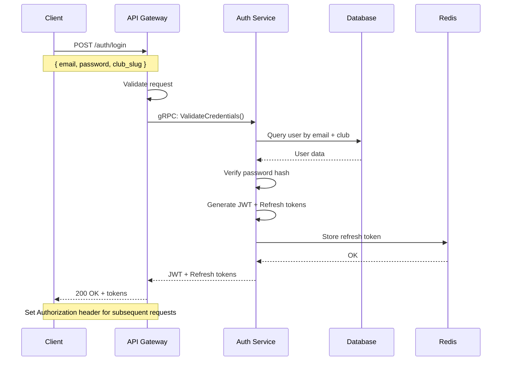

### JWT Validation Sequence

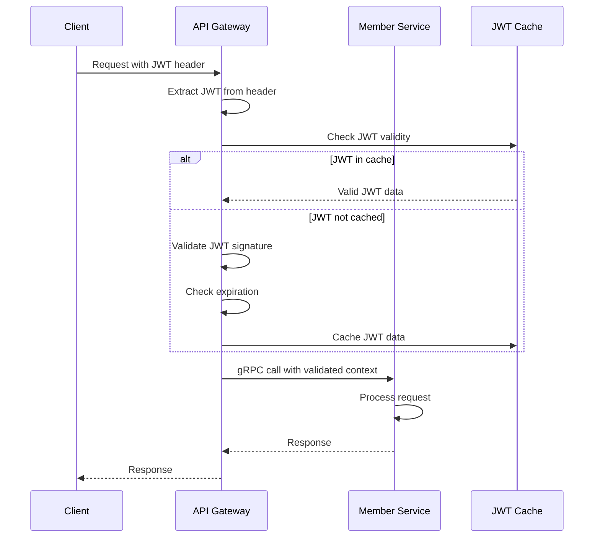

## 2. Member Registration Flow

### New Member Registration Sequence

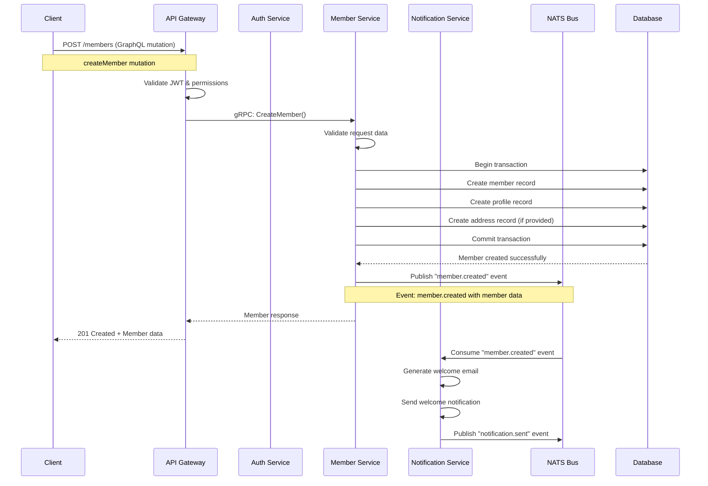

### Member Profile Update Sequence

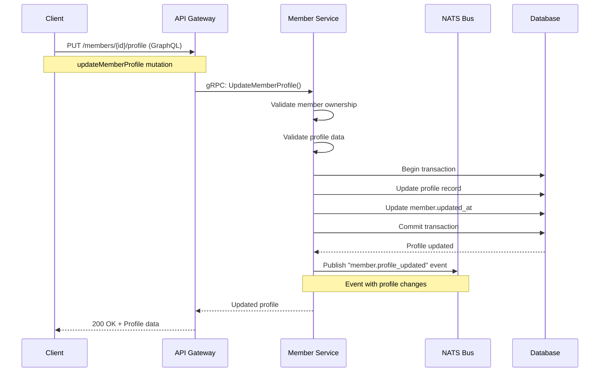

## 3. Club Management Flow

### Club Creation Sequence

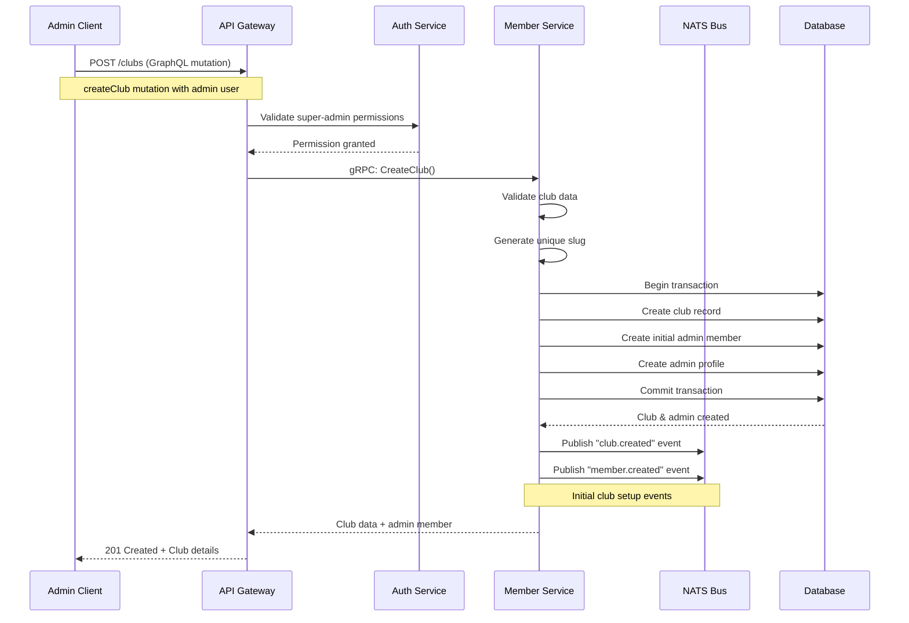

### Club Settings Update Sequence

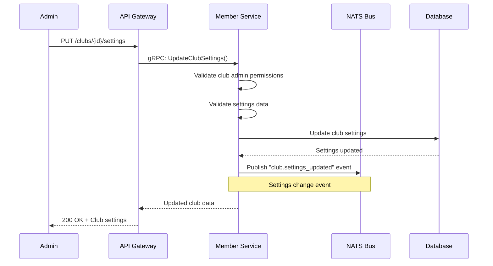

## 4. Reciprocal Agreement Flow

### Agreement Creation Sequence

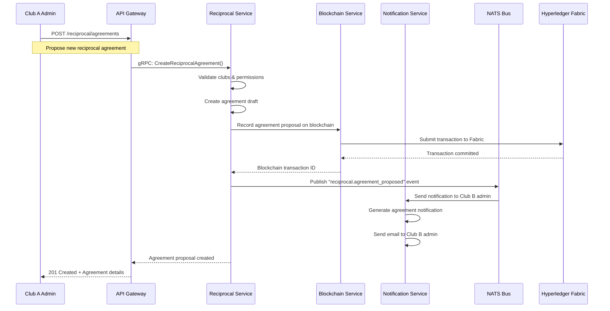

### Agreement Approval Sequence

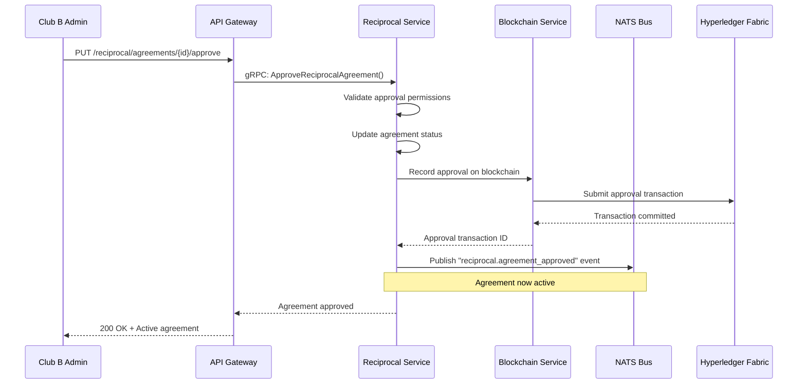

## 5. Visit Verification Flow

### Visit Recording Sequence

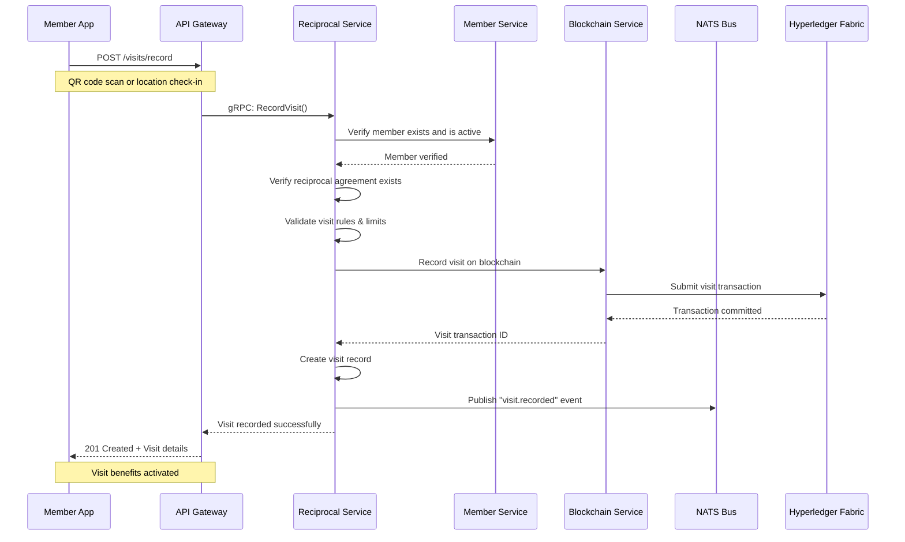

### Visit Verification Sequence

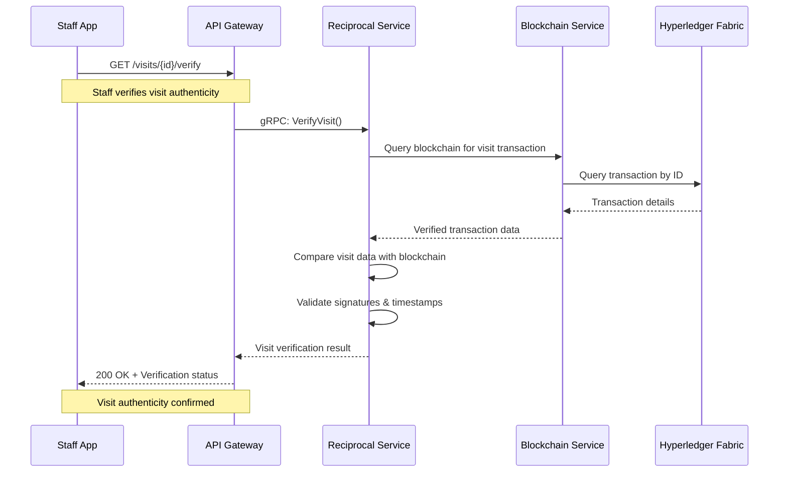

## 6. Notification Flow

### Multi-Channel Notification Sequence

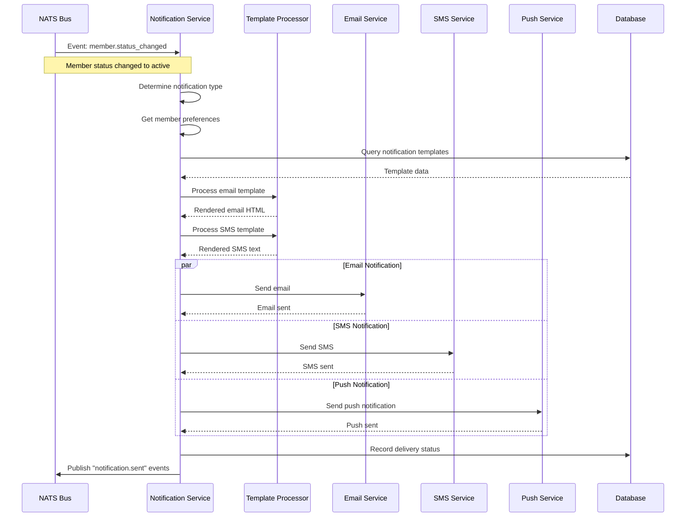

## 7. Analytics Data Collection Flow

### Event Processing Sequence

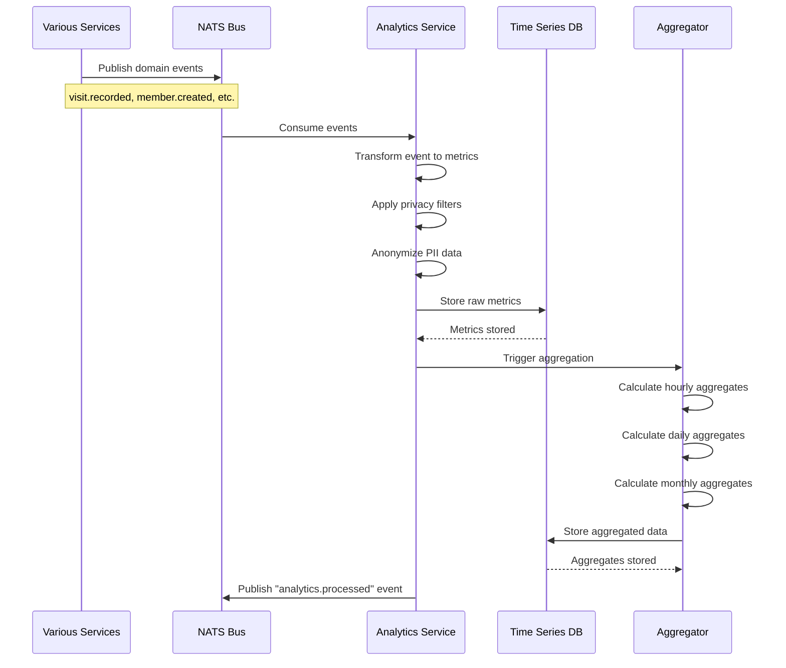

## 8. Governance Voting Flow

### Proposal Creation and Voting Sequence

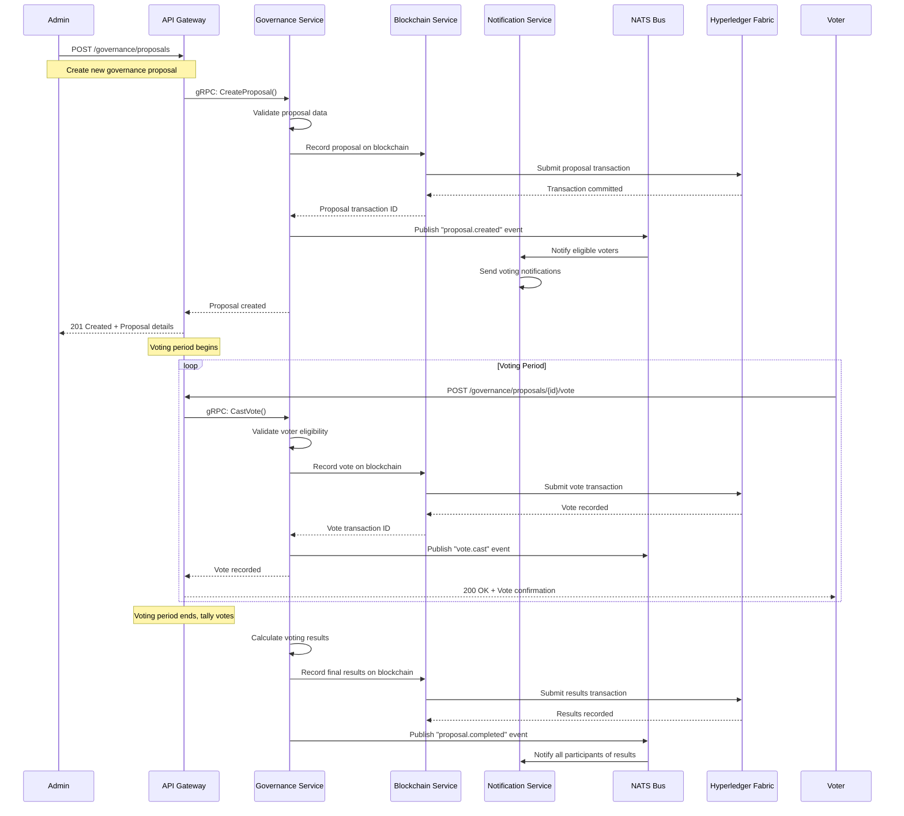

## 9. Error Handling and Recovery Flow

### Service Failure Recovery Sequence

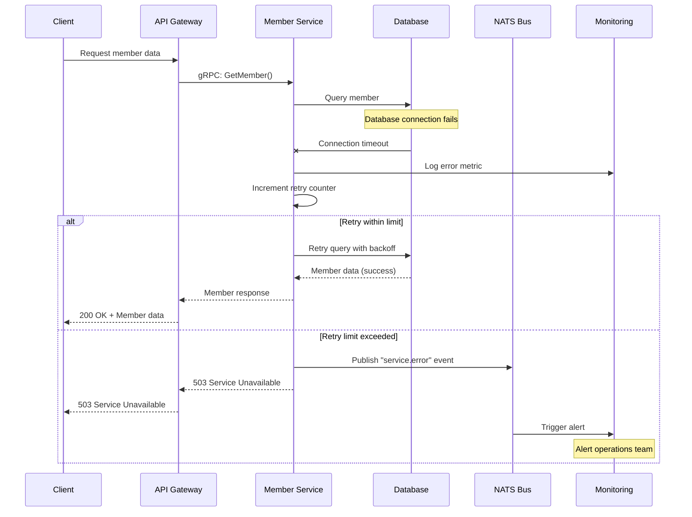

## 10. Cross-Service Transaction Flow (Saga Pattern)

### Distributed Transaction Coordination

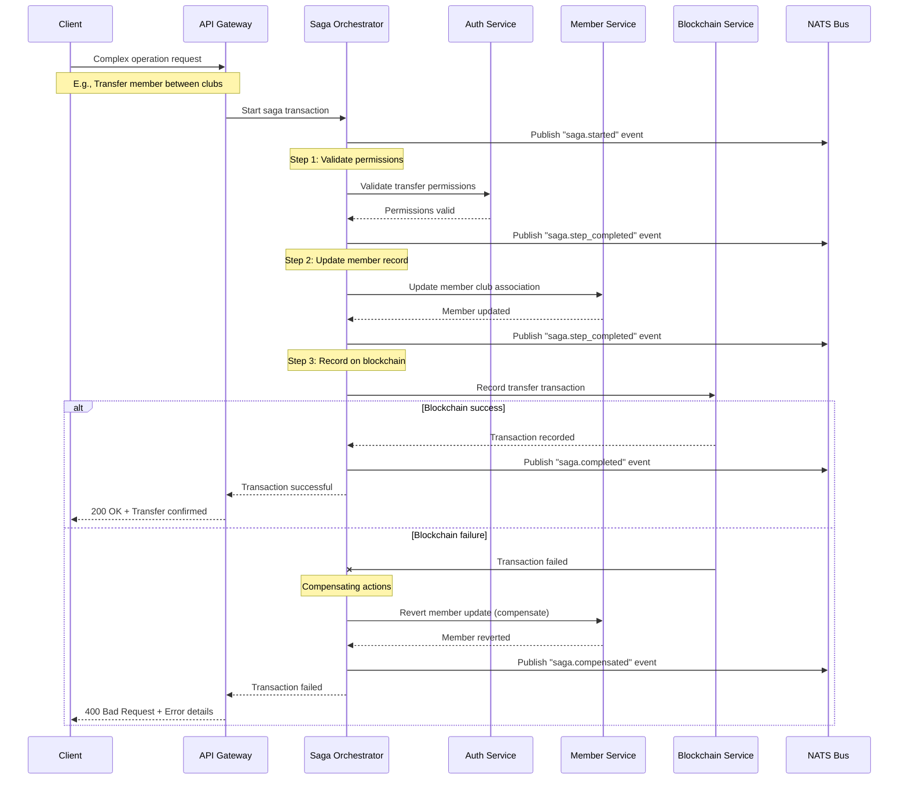

These sequence diagrams provide a comprehensive view of the key workflows in the Reciprocal Clubs Backend system, showing how different services interact to accomplish complex business processes while maintaining data consistency and providing robust error handling.