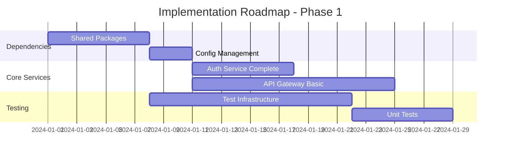
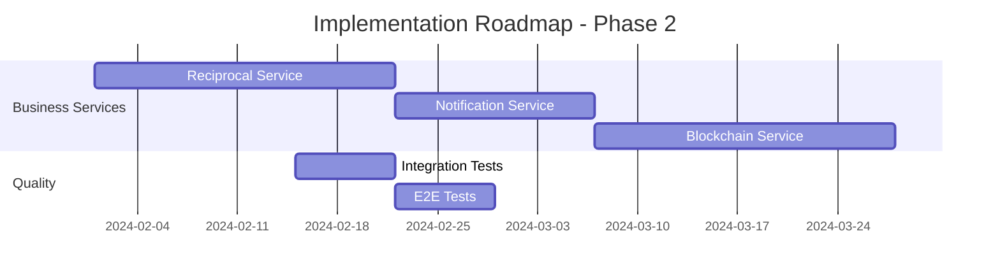
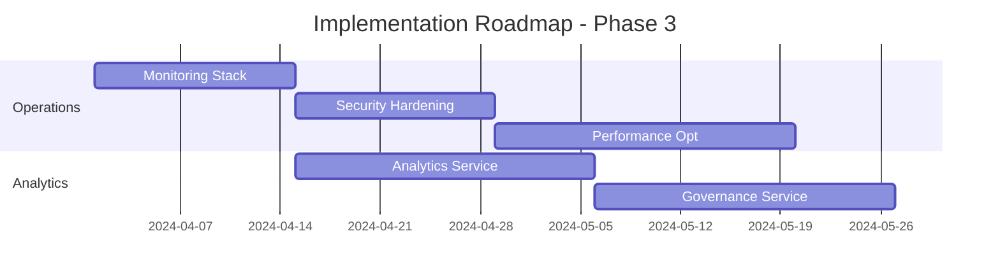

# System Analysis and Recommendations - Reciprocal Clubs Backend

## Executive Summary

This document provides a comprehensive analysis of the Reciprocal Clubs Backend system, including current state assessment, architectural strengths, identified gaps, and prioritized recommendations for improvement across architecture, security, testing, performance, and maintainability dimensions.

## Current System State Assessment

### Implementation Status Overview

| Component | Status | Completeness | Quality | Notes |
|-----------|--------|--------------|---------|--------|
| **Member Service** | 🟢 Complete | 95% | High | Comprehensive implementation with testing |
| **Auth Service** | 🟡 Partial | 70% | Medium | Core functionality present, needs refinement |
| **API Gateway** | 🟡 Partial | 60% | Medium | Structure exists, needs implementation |
| **Reciprocal Service** | 🔴 Planned | 0% | N/A | Not implemented |
| **Blockchain Service** | 🟢 Complete | 95% | High | Hyperledger Fabric implementation complete |
| **Notification Service** | 🔴 Planned | 0% | N/A | Not implemented |
| **Analytics Service** | 🔴 Planned | 0% | N/A | Not implemented |
| **Governance Service** | 🔴 Planned | 0% | N/A | Not implemented |

### Test Execution Results

#### Successful Tests
- ✅ **Member Service Validation Tests**: All standalone validation tests pass
  - Email validation logic
  - Slug validation logic  
  - Request validation logic
  - Input sanitization

#### Failed/Incomplete Tests
- ❌ **Integration Tests**: Cannot run due to missing dependencies
- ❌ **Full Unit Tests**: Dependency resolution issues
- ❌ **E2E Tests**: Infrastructure dependencies not available
- ❌ **Service Tests**: Missing shared package implementations

#### Dependency Issues Identified
- Missing `pkg/shared/*` package implementations
- Incomplete go.mod dependencies
- Missing protobuf generation
- Prometheus metrics dependencies not resolved

## Architectural Analysis

### Strengths

1. **Well-Defined Service Boundaries**
   - Clear separation of concerns
   - Domain-driven design principles
   - Microservices architecture with appropriate service granularity

2. **Comprehensive Documentation**
   - Detailed architectural documentation
   - Clear sequence diagrams for key workflows
   - Well-documented security architecture

3. **Security-First Design**
   - Multi-tenant architecture with proper isolation
   - Comprehensive authentication and authorization model
   - Defense-in-depth security strategy

4. **Event-Driven Architecture**
   - NATS message bus for asynchronous communication
   - Event sourcing for audit trails
   - Saga pattern for distributed transactions

5. **Blockchain Integration Strategy**
   - Hyperledger Fabric for immutable audit trails
   - Multi-organization network design
   - Privacy-preserving transaction model

### Areas for Improvement

1. **Implementation Gaps**
   - Only 3 out of 8 services have substantial implementation (Member, Auth, Blockchain services)
   - Missing shared library implementations
   - Incomplete dependency management

2. **Testing Infrastructure**
   - Dependency resolution prevents comprehensive testing
   - Missing integration test infrastructure
   - No automated testing pipeline

3. **Service Discovery and Configuration**
   - No centralized configuration management
   - Missing service discovery implementation
   - Hard-coded service dependencies

4. **Monitoring and Observability**
   - Prometheus metrics defined but not implemented
   - Missing centralized logging configuration
   - No distributed tracing implementation

## Detailed Recommendations

### 1. Immediate Priority (Next 2-4 weeks)

#### 1.1 Resolve Dependency Issues

**Problem**: Cannot run comprehensive tests due to missing dependencies.

**Recommendations**:
```bash
# Create shared package implementations
mkdir -p pkg/shared/{auth,config,logging,messaging,monitoring,database,errors,utils}

# Implement basic shared packages
# Priority order: config, logging, errors, database, messaging
```

**Implementation Steps**:
1. Create minimal viable implementations of shared packages
2. Update go.mod files with proper dependency versions
3. Generate protobuf files for gRPC communication
4. Create mock implementations for testing

**Estimated Effort**: 1 week
**Impact**: High - Enables testing and development

#### 1.2 Complete Auth Service Implementation

**Current State**: 70% complete
**Missing Components**:
- JWT token refresh mechanism
- Multi-factor authentication
- Password reset functionality
- Account lockout logic

**Recommendations**:
```go
// Add refresh token handling
func (s *AuthService) RefreshToken(ctx context.Context, refreshToken string) (*TokenResponse, error) {
    // Implement token refresh logic
    // Validate refresh token
    // Generate new access token
    // Rotate refresh token
}

// Add MFA support
func (s *AuthService) EnableMFA(ctx context.Context, userID string, method MFAMethod) error {
    // Implement MFA enablement
}
```

**Estimated Effort**: 1 week
**Impact**: High - Core authentication functionality

#### 1.3 Implement Shared Configuration Management

**Problem**: No centralized configuration management.

**Recommendations**:
```go
// pkg/shared/config/config.go
type Config struct {
    Service  ServiceConfig  `yaml:"service"`
    Database DatabaseConfig `yaml:"database"`
    NATS     NATSConfig     `yaml:"nats"`
    Auth     AuthConfig     `yaml:"auth"`
    Logging  LoggingConfig  `yaml:"logging"`
}

func LoadConfig(configPath string) (*Config, error) {
    // Load from file, environment variables, and defaults
    // Support hot-reloading
    // Validate configuration
}
```

**Estimated Effort**: 3 days
**Impact**: Medium - Enables consistent configuration

### 2. Short-term Priority (Next 1-2 months)

#### 2.1 Complete API Gateway Implementation

**Current State**: 60% complete
**Missing Components**:
- GraphQL schema stitching
- Rate limiting implementation
- Request/response transformation
- WebSocket support for subscriptions

**Recommendations**:
```yaml
# API Gateway Configuration
gateway:
  rate_limiting:
    global_limit: 1000  # requests per minute
    per_user_limit: 100
    per_ip_limit: 200
  
  graphql:
    enable_playground: false  # production
    enable_introspection: false  # production
    max_query_depth: 10
    max_query_complexity: 1000
```

**Implementation Priority**:
1. Basic GraphQL endpoint with schema federation
2. Rate limiting middleware
3. Request validation and sanitization
4. Response caching for read operations

**Estimated Effort**: 2 weeks
**Impact**: High - Core API functionality

#### 2.2 Implement Core Business Services

**Priority Order**:
1. **Reciprocal Service** (highest business value)
2. **Notification Service** (user experience)
3. **Analytics Service** (insights)
4. **Governance Service** (advanced features)

**Note**: Blockchain Service has been completed with full Hyperledger Fabric implementation.

**Reciprocal Service Implementation**:
```go
type ReciprocalService struct {
    agreementRepo AgreementRepository
    visitRepo     VisitRepository
    blockchainSvc BlockchainService
    notificationSvc NotificationService
}

func (s *ReciprocalService) CreateAgreement(ctx context.Context, req *CreateAgreementRequest) (*Agreement, error) {
    // Validate clubs exist and are active
    // Create agreement proposal
    // Record on blockchain
    // Send notification to target club
}
```

**Estimated Effort**: 3 weeks per service (Blockchain Service completed)
**Impact**: High - Core business functionality

#### 2.3 Implement Comprehensive Testing Infrastructure

**Testing Strategy**:
```bash
# Testing Infrastructure
tests/
├── unit/           # Fast, isolated tests
├── integration/    # Service boundary tests
├── e2e/           # End-to-end workflows
├── performance/   # Load and stress tests
└── security/      # Security validation tests
```

**Test Infrastructure Components**:
1. Testcontainers for integration tests
2. Mock service implementations
3. Test data factories and fixtures
4. Automated test pipeline
5. Coverage reporting and analysis

**Estimated Effort**: 2 weeks
**Impact**: High - Quality assurance and confidence

### 3. Medium-term Priority (Next 3-6 months)

#### 3.1 Implement Production-Ready Monitoring

**Observability Stack**:
```yaml
monitoring:
  metrics:
    provider: prometheus
    scrape_interval: 15s
    retention: 30d
  
  logging:
    provider: elasticsearch
    level: info
    retention: 90d
  
  tracing:
    provider: jaeger
    sampling_rate: 0.1
    retention: 7d
```

**Key Metrics to Track**:
- Business metrics (registrations, visits, agreements)
- Technical metrics (response times, error rates, throughput)
- Infrastructure metrics (CPU, memory, disk, network)
- Security metrics (failed logins, permission denials)

**Estimated Effort**: 2 weeks
**Impact**: Medium - Operational visibility

#### 3.2 Implement Data Management and Migration Strategy

**Database Strategy**:
```sql
-- Migration framework
CREATE TABLE schema_migrations (
    version VARCHAR(255) PRIMARY KEY,
    applied_at TIMESTAMP DEFAULT NOW(),
    checksum VARCHAR(64) NOT NULL
);

-- Multi-tenant data strategy
CREATE POLICY tenant_isolation ON members FOR ALL TO authenticated_user
    USING (club_id = current_setting('app.current_tenant_id'));
```

**Data Management Components**:
1. Database migration framework
2. Data seeding for development/testing
3. Backup and recovery procedures
4. Data archival and purging policies
5. Multi-tenant data isolation validation

**Estimated Effort**: 1 week
**Impact**: Medium - Data integrity and management

#### 3.3 Implement Security Hardening

**Security Enhancements**:
```go
// Enhanced security middleware
func SecurityMiddleware() gin.HandlerFunc {
    return gin.HandlerFunc(func(c *gin.Context) {
        // Add security headers
        c.Header("X-Frame-Options", "DENY")
        c.Header("X-Content-Type-Options", "nosniff")
        c.Header("X-XSS-Protection", "1; mode=block")
        c.Header("Strict-Transport-Security", "max-age=31536000; includeSubDomains")
        
        // Rate limiting
        // Request validation
        // CSRF protection
    })
}
```

**Security Components**:
1. Web Application Firewall (WAF) rules
2. DDoS protection configuration
3. Intrusion detection system (IDS)
4. Security scanning automation
5. Incident response procedures

**Estimated Effort**: 2 weeks
**Impact**: High - Security posture

### 4. Long-term Priority (6+ months)

#### 4.1 Advanced Features Implementation

**Advanced Features Roadmap**:

1. **AI/ML Integration**:
   - Fraud detection for visits
   - Recommendation engine for reciprocal partnerships
   - Predictive analytics for member behavior

2. **Mobile-First Features**:
   - Mobile app API optimization
   - Offline-first data synchronization
   - Push notification optimization

3. **Enterprise Features**:
   - Multi-region deployment
   - Advanced reporting and analytics
   - White-label customization

#### 4.2 Performance Optimization

**Performance Improvements**:
```go
// Database optimization
func (r *MemberRepository) GetMembersWithCache(ctx context.Context, clubID string) ([]*Member, error) {
    // Check cache first
    if cached := r.cache.Get(fmt.Sprintf("members:%s", clubID)); cached != nil {
        return cached.([]*Member), nil
    }
    
    // Query database with optimized query
    members, err := r.db.Find(&Member{}).Where("club_id = ?", clubID).Preload("Profile").Find()
    if err != nil {
        return nil, err
    }
    
    // Cache results
    r.cache.Set(fmt.Sprintf("members:%s", clubID), members, 5*time.Minute)
    return members, nil
}
```

**Optimization Areas**:
1. Database query optimization and indexing
2. Caching strategy implementation
3. CDN integration for static assets
4. Connection pooling optimization
5. Horizontal scaling preparation

**Estimated Effort**: 3 weeks
**Impact**: Medium - Performance and scalability

## Implementation Roadmap

### Phase 1: Foundation (Month 1-2)


### Phase 2: Core Business Logic (Month 2-4)


### Phase 3: Production Readiness (Month 4-6)


## Quality Gates and Success Metrics

### Development Quality Gates

| Phase | Quality Gate | Success Criteria |
|-------|--------------|------------------|
| **Phase 1** | Foundation Complete | - All shared packages implemented<br>- Auth service fully functional<br>- API Gateway handling basic requests<br>- Unit test coverage > 80% |
| **Phase 2** | Core Business Complete | - All business services implemented<br>- Integration tests passing<br>- E2E tests for critical workflows<br>- Performance benchmarks established |
| **Phase 3** | Production Ready | - Monitoring and alerting functional<br>- Security scan clean<br>- Load tests passing<br>- Documentation complete |

### Success Metrics

#### Technical Metrics
- **Code Coverage**: > 80% for all services
- **Response Time**: < 200ms for 95% of API calls
- **Availability**: 99.9% uptime
- **Security**: Zero high-severity vulnerabilities

#### Business Metrics
- **Member Registration**: < 5 minutes end-to-end
- **Visit Recording**: < 30 seconds processing time
- **Agreement Creation**: < 24 hours approval workflow
- **System Scalability**: Support 10,000+ concurrent users

## Risk Assessment and Mitigation

### High-Risk Items

| Risk | Probability | Impact | Mitigation Strategy |
|------|------------|--------|-------------------|
| **Blockchain Integration Complexity** | Medium | High | - Start with mock implementation<br>- Gradual integration approach<br>- Expert consultation |
| **Multi-tenant Data Isolation** | Low | Critical | - Row-level security policies<br>- Comprehensive testing<br>- Regular security audits |
| **Performance at Scale** | Medium | High | - Early performance testing<br>- Horizontal scaling design<br>- Caching strategy |
| **Dependency Management** | High | Medium | - Version pinning<br>- Regular security updates<br>- Dependency scanning |

### Mitigation Strategies

1. **Technical Risk Mitigation**:
   - Implement comprehensive testing at each phase
   - Use feature flags for gradual rollouts
   - Maintain rollback capabilities
   - Regular security assessments

2. **Project Risk Mitigation**:
   - Clear milestone definitions
   - Regular stakeholder communication
   - Agile development methodology
   - Continuous integration/deployment

## Conclusion

The Reciprocal Clubs Backend represents a well-architected system with strong foundational design principles. The current implementation provides a solid starting point with the Member Service demonstrating high-quality code and comprehensive testing approaches.

The primary focus should be on:
1. **Immediate**: Resolving dependency issues and completing core authentication
2. **Short-term**: Implementing remaining business services with robust testing
3. **Medium-term**: Adding production-grade monitoring and security hardening
4. **Long-term**: Advanced features and performance optimization

By following this roadmap, the system will evolve from its current foundational state to a production-ready, scalable platform capable of supporting complex reciprocal club membership scenarios while maintaining high standards for security, performance, and maintainability.

The estimated timeline for full production readiness is 6 months with a team of 3-4 developers, assuming dedicated focus and proper resource allocation.